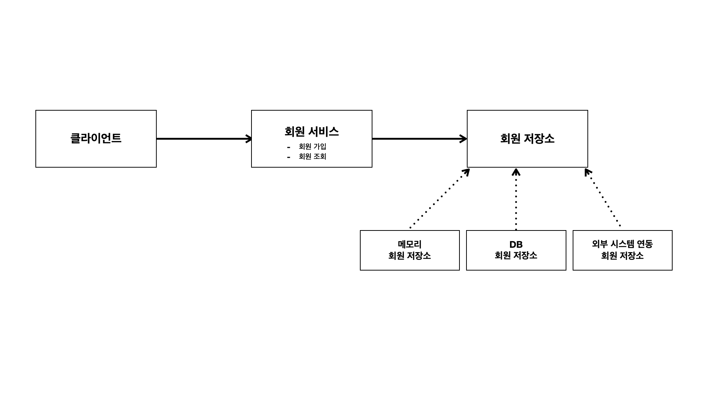
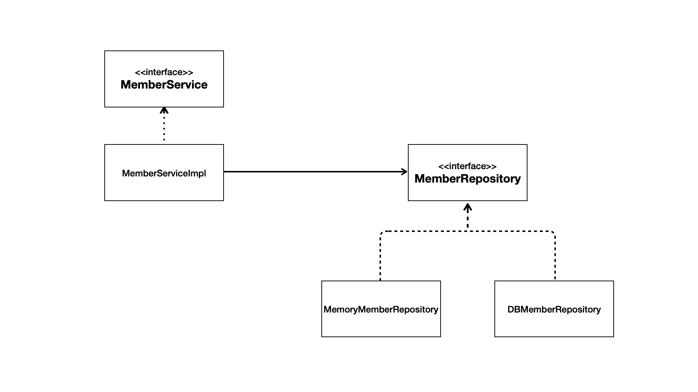
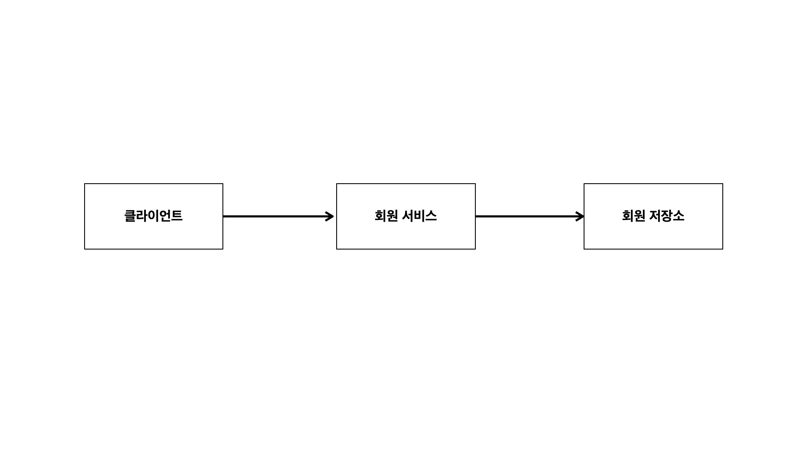
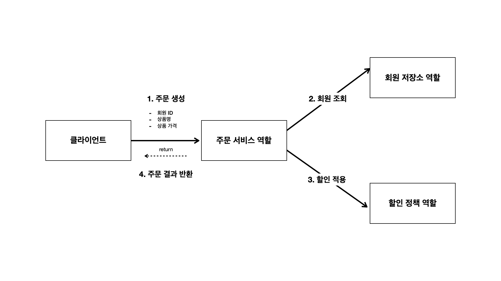
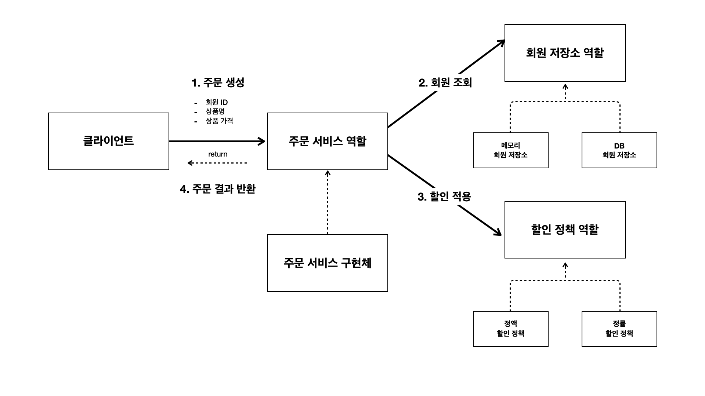
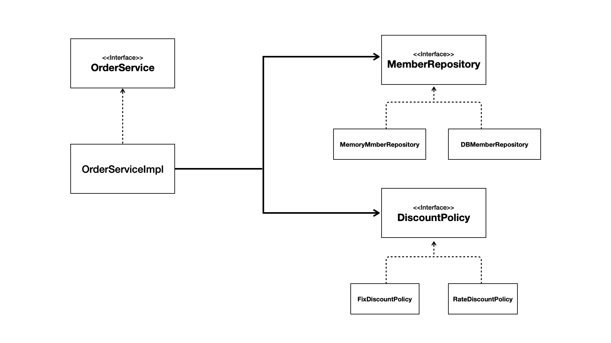
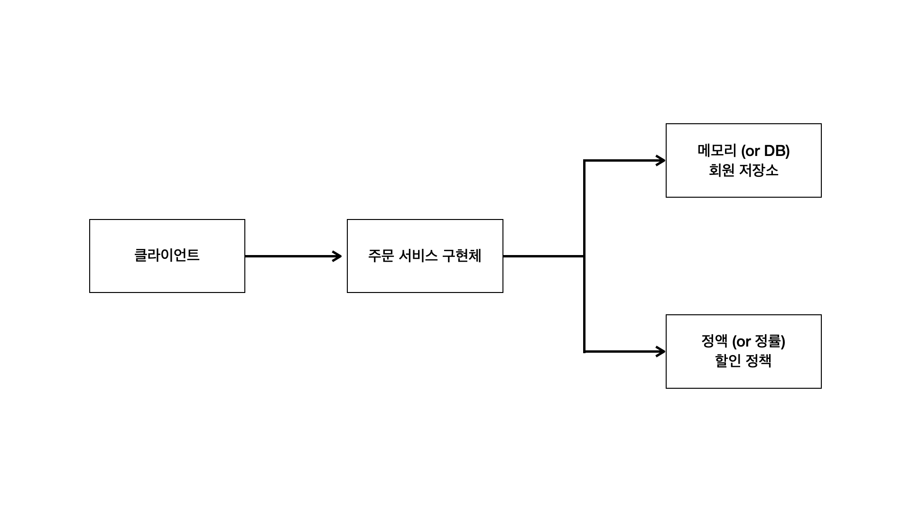

## 비즈니스 요구사항과 설계

회원
- 회원을 가입하고 조회 가능
- 회원은 일반 등급과 VIP 등급을 가짐
- 회원 데이터는 자체 DB를 구현할 수 있고, 외부 시스템과 연동할 수 있다 (미확정)

주문과 할인 정책
- 회원은 상품을 주문 가능
- 회원 등급에 따른 할인 정책 적용할 수 있음
- 할인 정책은 모든 VIP는 1000원을 할안해주는 고정 금액 할인(정액제)를 적용 (추후 변경 가능성 농후)
- 할인 정책 변경 가능성 높름

### 회원 도메인 설게

🗣️ 요구사항
- 회원 가입 및 회원 조회
- 회원 등급 있음 (일반, VIP)
- 회원 데이터 저장소 미확정

#### 회원 도메인 협력관계

#### 회원 클래스 다이어그램

### 회원 객체 다이어그램

### 주문과 할인 도메인 설계
🗣️ 요구사항
- 회원은 상품을 주문할 수 있음
- 회원 등급에 따라 할인 정책이 적용될 수 있음
- 할인 정책은 VIP 회원의 주문 금액에서 1000원을 할인해주는 고정 금액 할인을 적용
- 할인 정책 변경 가능성 높음

#### 주문 도메인 협력, 역할, 책임

#### 주문 도메인 전체

#### 주문 도메인 클래스 다이어그램

#### 주문 도메인 객체 다이어그램
